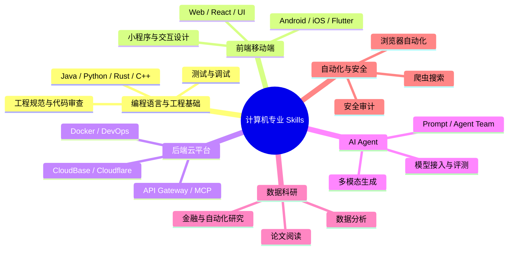

# 计算机专业 Skills 大合集

<p align="center">
  
  
  
  
  <a href="https://github.com/bighardperson/computer-science-skills-collection/releases/latest"></a>
  <a href="https://github.com/bighardperson/computer-science-skills-collection/stargazers"></a>
</p>

这是一个面向计算机专业学生、开发者和 AI Agent 使用者的 Skills 大合集。它整理了本机 Claude Code / OpenClaw 风格的 skill 库，覆盖编程语言、前后端、移动端、云服务、AI Agent、浏览器自动化、数据分析、科研论文、文档办公、安全审计和效率工作流等方向。

这个仓库的目标不是把资料堆在一起，而是把可复用的能力沉淀成一套可以浏览、复制、二次开发的知识库：你可以把它当成技能提示词库、AI Agent 工作流模板库，也可以把它当成计算机专业实践方向的路线图。

## 一键下载

如果你只是想先把全部 skills 拉到本地，推荐直接下载 Release：

```bash
curl -L -o computer-science-skills-collection.zip \
  https://github.com/bighardperson/computer-science-skills-collection/releases/latest/download/computer-science-skills-collection.zip
```

如果你想持续同步更新，推荐 clone 仓库：

```bash
git clone https://github.com/bighardperson/computer-science-skills-collection.git
cd computer-science-skills-collection
```

想快速装到本机 skills 目录，可以运行：

```bash
bash scripts/install.sh ~/.agents/skills
```

## 为什么值得收藏

- **覆盖面广**：当前收录 610 个 skill 入口文件（`SKILL.md` / `skill.md`），从 Java、Android、前端、云开发到科研、爬虫、安全审计都有入口。
- **结构清楚**：所有 skill 保留原始目录，并额外生成总目录、分类索引和学习路线。
- **适合二次开发**：每个 skill 都尽量保持可迁移的 Markdown 结构，方便改造成自己的 Claude Code / Codex / OpenClaw 工作流。
- **面向实战**：很多 skill 不只是概念说明，还包含命令、脚本、检查清单、参考资料和使用场景。
- **适合展示**：仓库按作品集方式整理，方便别人快速看懂你的技术栈、工具链和自动化能力。

## 快速导航

| 入口 | 说明 |
| --- | --- |
| [完整目录 CATALOG](CATALOG.md) | 全部 skills 的索引表，适合检索和浏览 |
| [学习路线](docs/LEARNING_ROADMAP.md) | 按计算机专业成长路径组织的使用路线 |
| [使用指南](docs/USAGE.md) | 如何复制、改造、安装和维护这些 skills |
| [传播文案](docs/SHARE_COPY.md) | 发朋友圈、社群、README 推荐时可直接使用 |
| [贡献指南](CONTRIBUTING.md) | 如何补充、优化和提交新的 skill |
| [公开说明](LICENSE_NOTICE.md) | 关于公开整理、敏感信息排除和来源尊重的说明 |

## 分类地图

| 分类 | 数量 |
| --- | ---: |
| [编程语言与工程基础](docs/categories/programming.md) | 124 |
| [前端、移动端与交互体验](docs/categories/frontend-mobile-ui.md) | 146 |
| [后端、云平台与 API](docs/categories/backend-cloud-api.md) | 70 |
| [AI、Agent 与模型应用](docs/categories/ai-agent-models.md) | 104 |
| [数据、算法与科研](docs/categories/data-algorithms-research.md) | 52 |
| [浏览器、搜索与自动化](docs/categories/browser-search-automation.md) | 18 |
| [安全、审计与质量保障](docs/categories/security-quality.md) | 10 |
| [文档、办公与内容生产](docs/categories/docs-office-content.md) | 28 |
| [效率工具、个人工作流与其他](docs/categories/workflow-others.md) | 58 |

## 能力地图



## 精选示例

| Skill | 分类 | 看点 |
| --- | --- | --- |
| [`agent-mail`](skills/agent-mail/SKILL.md) | AI、Agent 与模型应用 | Email inbox for AI agents. Check messages, send emails, and communicate via your own @agentmail.to address. |
| [`agentlens`](skills/agentlens/SKILL.md) | AI、Agent 与模型应用 | Navigate and understand codebases using agentlens hierarchical documentation. Use when exploring new projects, finding modules, locating symbols in large files, finding TODOs/warn… |
| [`AI绘图`](skills/AI绘图/SKILL.md) | AI、Agent 与模型应用 | Generate/edit images with Nano Banana Pro (Gemini 3 Pro Image). Use for image create/modify requests incl. edits. Supports text-to-image + image-to-image; 1K/2K/4K; use --input-im… |
| [`antivirus`](skills/antivirus/SKILL.md) | AI、Agent 与模型应用 | Scan installed OpenClaw skills for malicious code patterns including ClickFix social engineering, reverse shell (RAT), and data exfiltration. Uses OG-Text model for agentic detect… |
| [`apple-reminders`](skills/apple-reminders/SKILL.md) | AI、Agent 与模型应用 | Manage Apple Reminders via the `remindctl` CLI on macOS (list, add, edit, complete, delete). Supports lists, date filters, and JSON/plain output. |
| [`Apple提醒事项`](skills/Apple提醒事项/SKILL.md) | AI、Agent 与模型应用 | Manage Apple Reminders via the `remindctl` CLI on macOS (list, add, edit, complete, delete). Supports lists, date filters, and JSON/plain output. |
| [`arxiv-watcher`](skills/arxiv-watcher/SKILL.md) | AI、Agent 与模型应用 | Search and summarize papers from ArXiv. Use when the user asks for the latest research, specific topics on ArXiv, or a daily summary of AI papers. |
| [`ArXiv论文追踪`](skills/ArXiv论文追踪/SKILL.md) | AI、Agent 与模型应用 | Search and summarize papers from ArXiv. Use when the user asks for the latest research, specific topics on ArXiv, or a daily summary of AI papers. |
| [`audio-video-to-text`](skills/audio-video-to-text/SKILL.md) | AI、Agent 与模型应用 | 音视频转文字技能，使用 Whisper 进行语音识别。支持多种音视频格式，可输出纯文本、SRT/VTT 字幕或 JSON 格式。适用于会议记录、视频字幕生成、采访整理、播客转录等场景。 |
| [`auto-updater`](skills/auto-updater/SKILL.md) | AI、Agent 与模型应用 | Automatically update Clawdbot and all installed skills once daily. Runs via cron, checks for updates, applies them, and messages the user with a summary of what changed. |
| [`autoresearch`](skills/autoresearch/SKILL.md) | AI、Agent 与模型应用 | Run Karpathy-style autoresearch optimization on any content. Generates 50+ variants, scores with a 5-expert simulated panel, evolves winners through multiple rounds, outputs optim… |
| [`baidu-search`](skills/baidu-search/SKILL.md) | AI、Agent 与模型应用 | Search the web using Baidu AI Search Engine (BDSE). Use for live information, documentation, or research topics. |
| [`book-notes`](skills/book-notes/SKILL.md) | AI、Agent 与模型应用 | Capture reading notes through conversation, organize by book, generate summaries, track reading list. Never lose an insight from a book again. |
| [`book-writer`](skills/book-writer/SKILL.md) | AI、Agent 与模型应用 | 使用AI辅助写作的OpenClaw技能，可以根据提示词生成书籍大纲并逐级扩写内容，支持添加公式、图表、代码等元素。适用于学术著作、技术书籍、小说等多种类型的创作。 |
| [`capability-evolver`](skills/capability-evolver/SKILL.md) | AI、Agent 与模型应用 | A self-evolution engine for AI agents. Analyzes runtime history to identify improvements and applies protocol-constrained evolution. Communicates with EvoMap Hub via local Proxy m… |
| [`cli-anything-hub`](skills/cli-anything-hub/SKILL.md) | AI、Agent 与模型应用 | Discover agent-native CLIs for professional software. Access the live catalog to find tools for creative workflows, productivity, AI, and more. |
| [`content-factory`](skills/content-factory/SKILL.md) | AI、Agent 与模型应用 | Multi-agent content production system. One piece of source content becomes many formats — social posts, email, scripts, headlines, and more. Five specialized agent personas: Write… |
| [`content-repurposer`](skills/content-repurposer/SKILL.md) | AI、Agent 与模型应用 | Transform long-form content into platform-optimized snippets. Your agent takes one blog post, video transcript, or podcast notes and generates ready-to-publish Twitter threads, Li… |

## 推荐使用方式

1. 先看 [学习路线](docs/LEARNING_ROADMAP.md)，按自己的方向选择一条路线。
2. 再打开 [完整目录](CATALOG.md)，用浏览器搜索关键词，例如 `Android`、`Java`、`MCP`、`论文`、`安全`。
3. 找到对应 skill 后，进入 `skills/<skill-name>/SKILL.md` 或 `skill.md` 阅读触发规则、命令和参考资料。
4. 复制到自己的 Agent skill 目录，按项目实际路径、API 环境变量和工具链做最小改造。

## 仓库结构

```text
.
├── README.md                  # 项目首页与总览
├── CATALOG.md                 # 全量 skill 索引
├── docs/
│   ├── LEARNING_ROADMAP.md    # 计算机专业学习路线
│   ├── USAGE.md               # 使用与二次开发指南
│   └── categories/            # 按方向拆分的索引
├── scripts/
│   └── build_docs.py          # 自动生成目录文档
└── skills/                    # 原始 skills 内容
```

## 适合谁

- 想把 AI 编程工具用得更系统的计算机专业学生。
- 正在整理个人技术栈、作品集和自动化工作流的开发者。
- 想学习 Claude Code / Codex / OpenClaw skill 写法的人。
- 想快速搭建 Agent 工具库、提示词库或项目脚手架的人。

## 给 Star 的理由

如果你觉得这个仓库帮你节省了整理资料、写提示词、搭工作流的时间，欢迎点一个 Star。后续可以继续把它扩展成更完整的计算机专业技能地图：每个方向都有路线、示例、模板、工具链和实践项目。

## Star History

<p align="center">
  <picture>
    <source media="(prefers-color-scheme: dark)" srcset="https://api.star-history.com/svg?repos=bighardperson/computer-science-skills-collection&type=Date&theme=dark">
    
  </picture>
</p>
